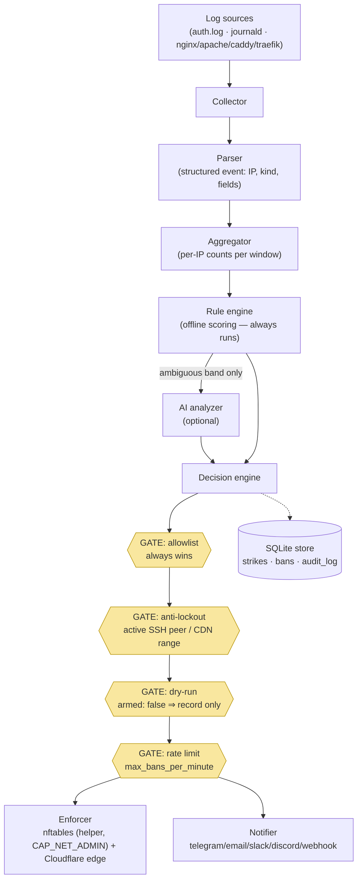

# Anatomy of a Ban

This guide follows **one real attack** — an SSH brute force from `203.0.113.66` — through every stage of the pipeline, showing what you see in `watch`, `status`, `list`, and `report` at each step, first in **dry-run** and then **armed**.

## The pipeline, visually



The yellow diamonds are the **safety gates**: every would-be ban passes through all four, in that order, on every decision. No rule, AI verdict, or feed can skip them.

## Stage by stage (dry-run — the default)

Your policy says `armed: false`. The attacker starts guessing passwords.

**1. Collector + parser.** sshd logs `Failed password for root from 203.0.113.66 port 40122 ssh2`; the journald collector picks it up and the SSH parser turns it into an `ssh_fail` event. Nothing visible yet — one failure is not an attack.

**2. Aggregator + rules.** By the 5th failure inside 60 seconds, the `ssh_bruteforce` rule (threshold 5) fires. In a second terminal, `ezyshield watch` shows the detection the moment it happens:

```console
$ ezyshield watch
12:04:31 detection 203.0.113.66  score=85 category=bruteforce rule=ssh_bruteforce
12:04:31 dry_ban   203.0.113.66  strike=1 ttl=5m0s
```

**3. Decision.** Score 85 ≥ `ban_threshold` (70) → ban band. The gates run: not allowlisted, not your SSH peer, not a shared CDN range — but the daemon is **not armed**, so the outcome is a `dry_ban`: recorded exactly like a real ban (strike 1, TTL 5m), enforced nowhere.

**4. What you see.**

```console
$ ezyshield status
Mode:        DRY-RUN
Active bans: 0        Simulated bans: 1

$ ezyshield list
IP             TTL     STRIKE  REASON                       SIMULATED
203.0.113.66   4m12s   1       score=85 category=bruteforce  yes
```

The attacker keeps going; strikes escalate (5m → 1h → 24h → …) — all simulated, all recorded, so escalation state is already real when you arm.

## The same attack, armed

You reviewed a few days of dry-run output and ran `sudo ezyshield arm` (pre-flight passes: enforcer healthy, admin CIDRs set, you would not ban yourself).

Stages 1–3 are identical — same events, same rule, same score, same gates. The difference is the last step:

```console
$ ezyshield watch
12:31:02 detection 203.0.113.66  score=85 category=bruteforce rule=ssh_bruteforce
12:31:02 ban       203.0.113.66  strike=2 ttl=1h0m0s
```

**Enforcement.** The daemon asks the privilege-separated helper (`ezyshield-enforcer`, the only process with `CAP_NET_ADMIN`) to add the IP to the `inet ezyshield` nftables set — packets drop at raw priority before any service sees them. If Cloudflare is configured, the IP lands on the edge list too. The notifier fires per your `notify:` config.

```console
$ ezyshield status
Mode:        ARMED
Active bans: 1

$ sudo nft list set inet ezyshield blocked | grep 203.0.113.66
                203.0.113.66 timeout 1h expires 59m58s
```

**Afterwards.** The full history is queryable — and strikes recorded since ADR-0011 carry the exact log lines that triggered them:

```console
$ ezyshield report 203.0.113.66
Abuse report — 203.0.113.66
  total strikes: 2
Strike history (newest first)
  [2] 2026-08-25T12:31:02Z  ttl 1h0m0s  score=85 category=bruteforce
      rules: rule/ssh_bruteforce: 6 events in 1m0s (threshold 5)
        | Failed password for root from 203.0.113.66 port 40122 ssh2
```

When the TTL lapses the ban expires everywhere (kernel timeout + reconcile); the strike history stays, so the next offense from this IP starts at strike 3.

## If something looks wrong

Banned a legitimate user? `sudo ezyshield allow <ip>` (allowlist wins over everything) or `sudo ezyshield unban <ip>`. Everything misbehaving? `sudo ezyshield disable --all` removes every block and disarms, preserving history. Diagnosis paths live in the [troubleshooting guide](troubleshooting.md).
