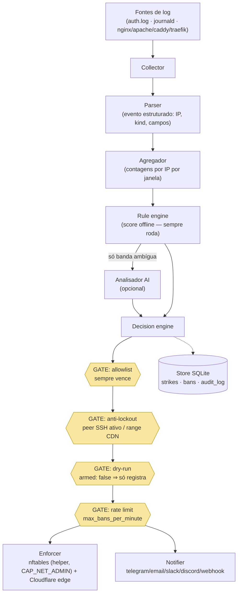

# Anatomia de um Ban

Este guia acompanha **um ataque real** — um brute force SSH de `203.0.113.66` — por cada estágio do pipeline, mostrando o que você vê no `watch`, `status`, `list` e `report` em cada passo, primeiro em **dry-run** e depois **armado**.

## O pipeline, visualmente



Os losangos amarelos são os **gates de segurança**: todo ban-em-potencial passa pelos quatro, nessa ordem, em toda decisão. Nenhuma regra, verdict de AI ou feed pode pulá-los.

## Estágio por estágio (dry-run — o padrão)

Sua policy diz `armed: false`. O atacante começa a chutar senhas.

**1. Collector + parser.** O sshd loga `Failed password for root from 203.0.113.66 port 40122 ssh2`; o collector journald captura e o parser SSH vira isso um evento `ssh_fail`. Nada visível ainda — uma falha não é um ataque.

**2. Agregador + regras.** Na 5ª falha em 60 segundos, a regra `ssh_bruteforce` (threshold 5) dispara. Num segundo terminal, `ezyshield watch` mostra a detecção na hora:

```console
$ ezyshield watch
12:04:31 detection 203.0.113.66  score=85 category=bruteforce rule=ssh_bruteforce
12:04:31 dry_ban   203.0.113.66  strike=1 ttl=5m0s
```

**3. Decisão.** Score 85 ≥ `ban_threshold` (70) → banda de ban. Os gates rodam: não está na allowlist, não é seu peer SSH, não é range de CDN compartilhado — mas o daemon **não está armado**, então o resultado é um `dry_ban`: registrado exatamente como um ban real (strike 1, TTL 5m), aplicado em lugar nenhum.

**4. O que você vê.**

```console
$ ezyshield status
Mode:        DRY-RUN
Active bans: 0        Simulated bans: 1

$ ezyshield list
IP             TTL     STRIKE  REASON                        SIMULATED
203.0.113.66   4m12s   1       score=85 category=bruteforce  yes
```

O atacante insiste; os strikes escalam (5m → 1h → 24h → …) — tudo simulado, tudo registrado, então o estado de escalada já é real quando você armar.

## O mesmo ataque, armado

Você revisou dias de saída em dry-run e rodou `sudo ezyshield arm` (o pre-flight passou: enforcer saudável, admin CIDRs definidos, você não baniria a si mesmo).

Os estágios 1–3 são idênticos — mesmos eventos, mesma regra, mesmo score, mesmos gates. A diferença é o último passo:

```console
$ ezyshield watch
12:31:02 detection 203.0.113.66  score=85 category=bruteforce rule=ssh_bruteforce
12:31:02 ban       203.0.113.66  strike=2 ttl=1h0m0s
```

**Enforcement.** O daemon pede ao helper com privilégio separado (`ezyshield-enforcer`, o único processo com `CAP_NET_ADMIN`) para adicionar o IP ao set nftables `inet ezyshield` — pacotes caem em prioridade raw antes de qualquer serviço vê-los. Se o Cloudflare está configurado, o IP entra na lista do edge também. O notifier dispara conforme seu `notify:`.

As escritas de ban e unban são serializadas contra o reconcile periódico: enquanto o daemon aplica ou remove um ban, um ciclo de reconcile espera sua vez. Assim o reconcile nunca observa uma mudança pela metade, e o ciclo que se sobrepõe a um ban recém-aplicado nunca o confunde com uma entrada obsoleta do firewall e o remove.

```console
$ ezyshield status
Mode:        ARMED
Active bans: 1

$ sudo nft list set inet ezyshield blocked | grep 203.0.113.66
                203.0.113.66 timeout 1h expires 59m58s
```

**Depois.** O histórico completo é consultável — e strikes registrados desde o ADR-0011 carregam as linhas de log exatas que os dispararam:

```console
$ ezyshield report 203.0.113.66
Abuse report — 203.0.113.66
  total strikes: 2
Strike history (newest first)
  [2] 2026-08-25T12:31:02Z  ttl 1h0m0s  score=85 category=bruteforce
      rules: rule/ssh_bruteforce: 6 events in 1m0s (threshold 5)
        | Failed password for root from 203.0.113.66 port 40122 ssh2
```

Quando o TTL vence, o ban expira em todo lugar (timeout do kernel + reconcile); o histórico de strikes fica, então a próxima ofensa desse IP começa no strike 3.

## Se algo parecer errado

Baniu um usuário legítimo? `sudo ezyshield allow <ip>` (a allowlist vence tudo) ou `sudo ezyshield unban <ip>`. Tudo se comportando mal? `sudo ezyshield disable --all` remove todo bloqueio e desarma, preservando o histórico. Caminhos de diagnóstico no [guia de troubleshooting](troubleshooting.md).
