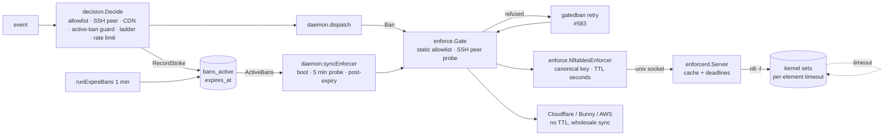
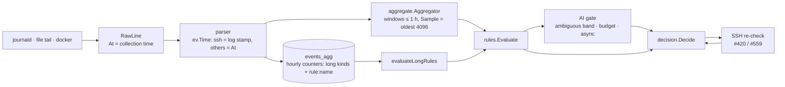

# EzyShield invariants — the properties the product promises, and who enforces them

Status: living document (issue #605, Phase 0). Line numbers refer to `dev` at
`f63551c` (2026-09-10); they drift, the file:function pairs do not.

## Why this file exists

Between 2026-09-08 and 2026-09-10 ten fixes landed on `dev`; two were
regressions of the fix before them (#590 from #589, #600 from #597) and two
more (#599, #603) were only found by watching one host after every restart.
Every fix was scoped to a symptom and tested against fakes that encoded the
same assumptions as the code. The common cause was that nobody had written
down what the system promises and which code paths enforce each promise —
so a change to one reader of a property silently broke another.

This file is that list. **A PR that changes any reader or writer named here
must carry a "Blast radius" section** (see the PR template) listing every
other reader/writer of the same invariant and how each was re-verified.
The harness scenarios that pin each invariant live under `internal/e2e/`
(Phase 1) and are named in the tables.

## How the pieces fit

### The ban lifecycle

Three clocks decide when a ban ends: the kernel timer (exact), the store's
`expires_at` (read by `ActiveBans`/`GetBanInfo`), and the reaper (once a
minute). Edge platforms have no per-item TTL; their lifetime is the store's
plus reconcile latency.

### The event pipeline

Two clocks judge evidence: `ev.Time` (aggregator windows) and processing
time (`HourBucket`, grace windows, rate limits). They agree only when there
is no backlog.

## A — Ban lifecycle

**A1. Store and kernel agree on the set of active bans (modulo reconcile latency).**

| role | file:function | predicate / key | clock | harness |
|---|---|---|---|---|
| write row | `store.RecordStrike`, `RecordManualBan` | upsert; `expires_at = now+TTL`, NULL = permanent | store clock | `e2e/ban_lifecycle` |
| read active (enforcement) | `store.ActiveBans` | `expires_at IS NULL` or `> now` (#279) | store clock | |
| read active (decision) | `store.GetBanInfo` | same predicate (#603) | store clock | |
| read active (reports) | `store/report.go`, `digest.go`, `retention.go` | **row presence only** — gap B7 | — | |
| kernel write | `daemon.dispatch` → Gate → `NftablesEnforcer.Ban` → `enforcerd add` | `Op=="ban"`, under `enforceMu` (#575) | | |
| kernel repair | `daemon.syncEnforcer` (boot, 5 min probe, after expiry with n>0, `disable --all`) | presence diff on `CanonicalIPKey` (#592); covered adds retried after removals (#590) | | |
| helper truth | `enforcerd.Server` cache with deadlines (#383), rebuilt from `nft list set … expires` on start; auto-merge migration (#588) | | `nowFn` | |
| edge | `CloudflareListsEnforcer.Sync` (removals deferred ≤ 3 min), Bunny/AWS wholesale (capacity overflow keeps newest) | | | |

**A2. A ban lasts exactly its TTL in every layer.** Ladder → store `expires_at` → helper deadline → nft `timeout` → edge (no TTL). Known divergences: client truncates `int64(TTL.Seconds())` so < 1 s → permanent (#615); reaper compares RFC3339 strings lexicographically (gap B6); edge lifetime = TTL + ≤ 1 min + ≤ 3 min.

**A3. Every element is spelled canonically everywhere.** `decision` unmaps; `enforce.CanonicalIPKey` (bare address for /32 and /128, masked prefix otherwise) on both sides of every reconcile; helper canonicalises verbs and trusts nft's own rendering on init. Edge list items compared verbatim (only bare spellings are ever sent).

**A4. Enforcement happens only through the helper and only for gate-accepted targets.** Every `d.enforcer` writer goes through `enforce.Gate` (static allowlist + SSH-peer probe, narrowed under ADR-0013 via `SSHPeerProbeSetter`, #583). **Exception:** reputation feeds write through the raw enforcer with their own filter (`feeds.go`), static allowlist and the raw `/proc` peer probe only (gap B8).

**A5. Reconcile repairs drift and never creates it.** Holds for single-IP bans. Violated for: manual CIDR bans (no row → deleted as stale, #609); sub-second TTLs (#615); a failing add aborts before the removal pass (skip, not creation).

Gaps (open): #608 (allow never lifts a ban), #609 (CIDR ban reverted), #615 (sub-second TTL), B3 `unban <cidr>` leaves contained elements until reconcile, B4 edge removals lag but report success, B6 string-compared expiry, B7 report readers without the expiry predicate, B9 store-failure fallback strands the kernel element.

## B — Operator immunity

**B1. The allowlist wins over every rule, AI verdict, feed, geo/ASN block and manual ban, in every layer.**

| layer | reader | source | note |
|---|---|---|---|
| decision | `decision.Engine` (allowlist, admin_cidrs, `SSH_CLIENT`, CDN ranges, verified bots) | static, frozen at `New` | runtime allowlist checked *before* `Decide` in the pipeline, re-check and async AI |
| manual ban | `AuthorizeManualBan` | static + runtime (`Overlaps`) | `--force` only overrides CDN ranges |
| gate | `enforce.Gate.refuse` | **static only** | no runtime setter — #608 |
| enforcers / edge | `NftablesEnforcer`, Cloudflare, Bunny, AWS | static only | |
| feeds | `feedEntryGuarded` | static + raw peers + CDN | no runtime — #608 |
| kernel | `@allowed accept` | `prerouting` only; `input`/`forward` drop unconditionally — #608 | |

**B2. An operator's live SSH session cannot be banned by any path.** Engine probe (2 s cache) and gate probe (fresh) share one predicate under ADR-0013; re-check (#420) and deferred enforcement (#583) re-run the full guards; manual bans (#211), `arm` preflight, AI verdicts (inline and async) go through `Decide`. Gaps: engine cache vs fresh gate can commit a row for the operator that the reconcile enforces after the session ends (A-G5); async AI never arms the re-check (D3-1); ADR-0013 `firstSeen` can give a reconnect zero grace (A-G6).

**B3. Kernel `@allowed` mirrors the effective allowlist.** Written at boot, on `allow` (single add, failure not retried), `unallow` (full resync), expiry sweep (only when n>0). **Never periodically re-synced** — an external `nft flush ruleset` leaves it empty until restart (A-G3).

**B4. Static allowlist and admin_cidrs are frozen per process** — editing `policy.yaml` protects nothing until restart (A-G8; document or add a reload that rebuilds all four copies together).

## C — Event pipeline

**C1. One log line is counted exactly once.** Collectors start at the live tail (`-n 0`, `tail=0`, seek EOF — #599). Violations: file-tail rotation replay and copytruncate blindness (#611); `events_agg` has no idempotency key (any replay double-counts long rules with threshold 5); the same evidence is `Decide`d up to three times (pipeline, async AI, re-check) and each hit bumps the suppressed counters (E1-5).

**C2. Evidence is judged at the time it happened.** Only the SSH parser keeps the log timestamp (and interprets an unzoned stamp in the daemon's zone — E2-1); every other parser stamps collection time. Aggregator windows use `ev.Time`; counters, grace, rate limits and re-check deadlines use processing time. Under a backlog: SSH bursts processed late count zero, HTTP trickles compress into false bursts (E2-2), pre-ban lines processed after the ban fire `ban_ineffective` (E2-3).

**C3. A rule fires on exactly the events it claims.** Violations: aggregator flushed with the last window instead of the longest — every hourly tier sees ≤ 10 min (#610); `Sample` keeps the oldest 4096, so busy IPs are blind to field-level sustained rules (E3-2); drop-in overrides keep the old `rule:` counter history (E3-3); validation accepts duplicate names, unreachable thresholds and unknown kinds (E3-4).

**C4. Hostile input never produces wrong attribution.** Fixed: X-Forwarded-For resolves to the rightmost untrusted hop (#612; parser tests `TestXFF_RightmostUntrustedHop`). Note: production wires the HTTP parsers with an empty trusted-proxy list — there is no config key yet — so header resolution is unreachable until #626. Combined/vhost formats behind a CDN attribute everything to the edge (E4-2, config/doc). IPv4-mapped forms split aggregator buckets (E4-3).

## D — Diagnostics, audit, gates, notifications

**D1. A diagnostic describes the present, not the past.** `ban_ineffective` phases (#586), decay and re-arm (#587/#600). Open: doctor reads `bans_active` without the expiry predicate (D1-1); `had_ineffective` never clears and drives a "enforcement looks broken" critical (D1-2); re-arm leaves `suppressed_total` (D1-3); doctor without root reports a valid 0640 config as FAIL (D1-4); no recovery notification (D1-5).

**D2. Every decision leaves an audit row with a stable vocabulary.** Open: gate refusal and late apply write no row while the ban is audited/listed/streamed as real (#614); manual-ban enforcer failure leaves no row and no DEGRADED (D2-2); `watch --kind` rejects half the ops writers emit, SIEM ranks `enforce_degraded` as Notice, Source labels drift (D2-3); `expire` has no stream event (D2-4).

**D3. The AI layer is consulted only when it can change the outcome and never bypasses policy.** Verified: AI verdicts pass the identical guards. Open: async path never arms the anti-lockout re-check (D3-1) and swallows `ErrRateLimited` (D3-2); budget-exhausted "rules-only" is invisible to `status`/`doctor` (D3-3).

**D4. Notifications never hide a critical event.** Violation: severity-blind rate limiter and pre-send dedup (#613); severity allowlists may exclude `critical` silently (D4-3).

## What the tests cover today (and with what)

| invariant | real components | fakes |
|---|---|---|
| A | store (`:memory:`) + fake enforcers; `NftablesEnforcer` + canned-JSON mock helper; `enforcerd.Server` + scripted nft | **no test chains store → enforcer → real helper** |
| B | engine + fake store; gate + fake inner; daemon + real store + fake enforcer (ADR-0013) | no test of runtime allow vs ban row vs edge; none of `input` chain order |
| C | collectors on temp files (copytruncate for the wrong reason); daemon tests drive `processRaw` directly; bench forces `ev.Time = clock` and never flushes | no real collector through the daemon |
| D | doctor on real sqlite (no expired rows); enfstate real store + fake enforcer; notify stubs never mix severities | engine diagnostics on a mock store |

The harness (Phase 1) closes the first column: real store, real engine, real daemon, real `enforcerd.Server` against a scripted kernel with per-element timeouts, one virtual clock (#606, #607).

## The blast-radius protocol

1. Name the invariant(s) your change touches (A1…D4).
2. List every reader/writer in that invariant's table and say how each was re-verified (test name, or "unchanged path, covered by X").
3. Add or extend a harness scenario that fails on `dev` before your fix.
4. A separate adversarial review tries to break the change against the *other* readers before merge.
